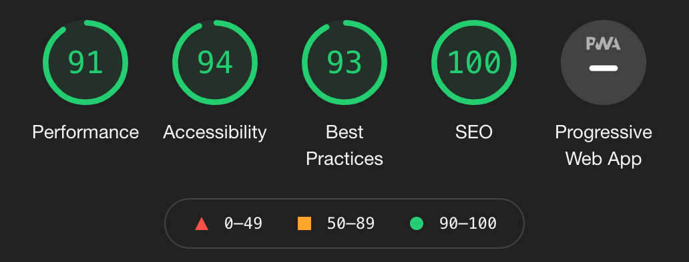

# Movie Junkies

## Author

Gabriel Alves

## Project Overview

This website was developed to break the mold of the movie nights with your friends and family, when a little competition can't hurt. It was created to be fun, intuitive, easy to play and, most importantly, to decide who's the 'know-it-all' in the room. The categories range in difficulty and are suitable for families of all sizes and ages.

- You can view my deployed website [here](https://gabriel-alves-p.github.io/movie-junkies/)

## Table of Contents
Generate after readme is complete for UX and below

## UX

### Project Goals

At the early stages of planning for the website, research was made regarding age gaps between people who partake in quizzes in the UK. It was found that it was largely above 18 years of age for UK, so after refining my research to exclude pub quizzes, the research came out with an average that ranged between 14 and 45 years old.

The website was largely designed to be appealing to young teenagers and adults in accordance with the research made. The questions and answers include both older films and new releases to match the wide range of ages which will be playing the quiz.

The website hopes to provide an extra layer of fun and entertainment to movie nights, either as an a pre-movie ice breaker or even afterwards to see who knows the most.

### Design Choices

#### Strategy Plane

- The basics of the website are that it is, at its core, a fun, easy-to-play and intuitive quiz for teenagers and adults.

#### Scope / Structure / Skeleton Planes

- The website would contain a very minimalistic landing page, with a simple logo at the top, instructions on how to play the quiz to follow, and finally the four categories of questions for the user to choose from.

- The second page (the quiz running page) would follow on to the same minimalistic idea of the first page, it would contain a question number, a score tracker, the quiz question, the four answer options for the user to click on and a 'return home' button.

- The last page (the score page) would simply have a your score, an fun image to match your score (whether a low score, a medium score or a hig score), a message to match your performance and a button to 'return home'.

- Each of the steps taken in the skeleton plane planning were done so as to only ever give a maximum of 4 clickable options on the screen for the user. It was done so that the website can only ever be intuitive and easy to navigate.

#### Surface Plane

##### Colors

The colors of the website were chosen to resemble an arcade's carpet. An iconic colorway of the 1980's. Although not all users will understand the theme or get the same feeling from the colors, they are still easy on the eyes and look the part on the quiz.

Colors were chosen with the help of [Coolors](https://coolors.co/).

##### Typography

Font styles and sizes were chosen to match the website's color palette and 1980's arcade theme.

Font style is called "Righteous" and it was chosen with the help of [Google Fonts](https://fonts.google.com/).

##### Images

The images used on the website were chosen solely for entertainment purpose and to match the arcade feel of the website.

##### Animations and Transitions

Special hovering effects were applied to all buttons on the website, a mixture of scaling and box-shadowing were used to make the buttons look like the neon lights at an arcade.

### Wireframes

Wireframes for this project can be found [here](https://drive.google.com/file/d/1J1Q6ZbRyVI-HSJThHyAYONjWD175Wdu1/view?usp=sharing)

### Features

#### Implemented Features

- On the landing page I have implemented a background audio that can be switched on and off by the user upon clickin on it.

- Following the audio button, we have the website's title and the game rules, so the user is aware of how to play the game before selecting to do so.

- The website then showcases the four different game options for the user to choose from and highlights them with a shadow-box.

- On the game-running pages I have added a header to the game container, followed by the question and the four options for answers (answers are highlighted in either green for correct or red for incorrect).

- All pages contain a "Return Home" button so the user can always start again from the beginning.

- Score page is kept minimalistic with two lines of text informing the user of their score, an image feature that matches the user's score and a button to return to the home page.

- The website has a 404 error page implemented that redirects the user directly back to our home page.

#### Future Features

- In the future I would like to implement two new categories for the games. These would be "Picture" and "Audio" based categories, which would use images and audios rather than text for the questions.

- Another feature I would like to implement to the website in the future are sound effects that are triggered when the user clicks on a correct or an incorrect answer.

- Lastly, I would like to implement a high-score board to the website, which users could then upload their best results up to.

## Testing

### Validation Testing

- All CSS files on this project were run through a [CSS Validator](https://jigsaw.w3.org/css-validator/) and passed.

- All HTML files on this project were run through a [HTML Validator](https://validator.w3.org/) and passed.

- All JavaScript files on this project were run through a [JavaScript Validator](https://jshint.com/) and passed.

### Cross Browser and Cross Device Testing

| TOOL / Device                 | BROWSER     | OS         | SCREEN WIDTH  |
|-------------------------------|-------------|------------|---------------|
| Real phone: iPhone 12 - horiz | Safari      | iOS        | S 844 x 390   |
| Real phone: iPhone XS Max     | Safari      | iOs        | S 425 x 900   |
| Dev tools emulator: Pixel 2   | Chrome      | Windows    | S 411 x 731   |
| Dev tools emulator: iPhone X  | Firefox     | iOS        | S 375 x 812   |
| Dev tools emulator: Nexus 7   | Chrome      | Windows    | M 600 x 960   |
| Real tablet: iPad             | Safari      | iOS        | M 768 x 1024  |
| Real tablet: iPad - horiz     | Safari      | iOS        | M 768 x 1024  |
| Dev tools emulator: iPad Pro  | Chrome      | Windows    | L 1024 x 1366 |
| Real computer: MacBook Pro    | Firefox     | Big Sur    | XL 1752 x 960 |
| Real computer: MacBook Air    | Safari      | Big Sur    | XL 1240 x 768 |

### Manual Testing
    
You can view my manual testing document [here](https://docs.google.com/spreadsheets/d/1NDrcY6318L0l5_bbKJrXnOSrcQA3j5oe7nytSbQG96Q/edit?usp=sharing).

### Defect Tracking

You should mention  any  bugs or problems you discovered during your testing, even if you haven't addressed them yet.

Here is a [Defect Tracking Template](https://docs.google.com/spreadsheets/d/1tYB4X4wTCNEW_Y1no3hsGbclh2bLokl_I5Ev3s5EuJA/edit?usp=sharing) you use as a starting point to track defects. Make a copy of the sheet to your own account and update the Features sheet to match your project. 

### Defects of Note
Some defects are more pesky than others. Highlight 3-5 of the bugs that drove you the most nuts and how you finally ended up resolving them.

### Outstanding Defects
It's ok to not resolve all the defects you found. If you know of something that isn't quite right, list it out and explain why you chose not to resolve it.

## Lighthouse Audits

- Below you will find my Lighthouse Audit.

## Deployment

This section should describe the process you went through to deploy the project to a hosting platform (e.g. GitHub Pages).

In particular, you should provide all details of the differences between the deployed version and the development version, if any.

Remember to use proper markdown for commands and enumerated steps.

You may want to re-watch the [initial deployment in gitpod video](https://learn.codeinstitute.net/courses/course-v1:CodeInstitute+LR101+2021_T1/courseware/4a07c57382724cfda5834497317f24d5/9b06129195c64fada6783de9cfe82d60/) when writing up this section.

Write out steps you would take and test them to deploy your code to GitHub Pages, include screenshots if you think they would make the process easier.

## Credits

To avoid plagiarism amd copyright infringement, you should mention any other projects, stackoverflow, videos, blogs, etc that you used to gather imagery or ideas for your code even if you used it as a starting point and modified things. Giving credit to other people's efforts and ideas that saved you time acknowledges the hard work others did. 

### Content

Use bullet points to list out sites you copied text from and cross-reference where those show up on your site

### Media

Make a list of sites you used images from. If you used several sites try to match up each image to the correct site. This includes attribution for icons if they came from font awesome or other sites, give them credit.

### Acknowledgments

This is the section where you refer to code examples, mentors, blogs, stack overflow answers and videos that helped you accomplish your end project. Even if it's an idea that you updated you should note the site and why it was important to your completed project.

If you used a CodeInstitute Example project as a starting point. Make note of that here.